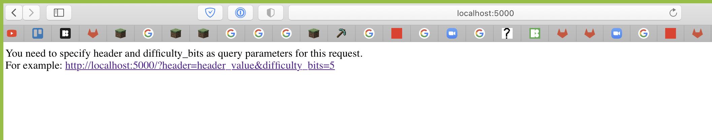
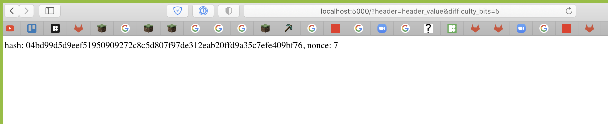

# IU DLT lab 06 submission

**Team members**:
* Ilya Alonov
* Leonid Lygin
* Roman Solovev
* Amir Subaev

**The code is converted to python3!!!!!!**

## Screenshots

## Answer to the `question`

One can modify `difficulty_bits` to decrease or increase the difficulty (bruh) of the proof-of-work function.

Arguably, you can also modify the block itself (some blocks are easier to mine than others due to nonce being lower).
